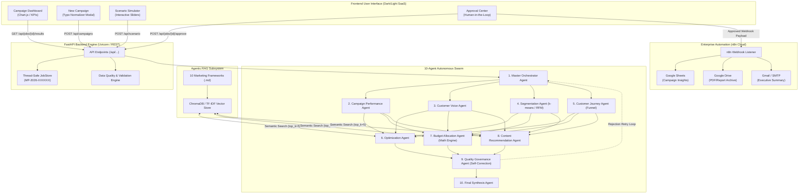

# 🚀 MarketPilot AI

[](https://www.python.org/)
[](https://fastapi.tiangolo.com/)
[](https://ai.google.dev/)
[](https://www.trychroma.com/)
[](https://n8n.io/)
[](https://opensource.org/licenses/MIT)
[-brightgreen)](https://docs.pytest.org/)

> **Multi-Agent Marketing Campaign Optimization & Customer Response Automation System**  
> *Academic Capstone Project — MBA / PGDM in Agentic AI for Business Automation (Group 6)*

MarketPilot AI is a production-style, autonomous multi-agent decision-support and workflow automation platform for modern marketing operations. It unites deterministic mathematical modeling (via Python `pandas`, `numpy`, and `scikit-learn`) with state-of-the-art agentic LLM reasoning (Google Gemini / OpenAI / Anthropic) to analyze cross-channel campaign data, evaluate qualitative customer sentiment, optimize media budgets, simulate what-if scenarios, and automatically trigger downstream enterprise workflows via n8n Cloud and Google Workspace.

---

## ✨ Key Features

- **🤖 10 Specialized Autonomous Agents:** Hierarchical swarm mirroring a full-stack marketing department (Orchestration, Performance Analytics, Customer Voice, Segmentation, Funnel Journey, Optimization, Budget Allocation, Content Strategy, Quality Governance, and Executive Synthesis).
- **🛡️ Strict Deterministic-AI Separation:** Arithmetic calculations (CTR, CPC, CPA, ROAS, RFM scoring, $k$-means clustering, budget optimization) are calculated exclusively in pure Python algorithms—completely eliminating LLM arithmetic hallucinations.
- **🔍 Pre-Flight Input Normalization:** Intelligent fuzzy entity matching using `difflib.SequenceMatcher` to catch and correct brand, geography, and channel typos before pipeline execution with human-in-the-loop verification.
- **📚 Agentic RAG (Dual-Engine):** Ingests and semantic-indexes 10 authoritative marketing frameworks into ChromaDB (`all-MiniLM-L6-v2`) with a zero-dependency TF-IDF cosine similarity fallback engine.
- **⚖️ Self-Correcting Quality Governance:** Automated programmatic audits enforcing budget conservation ($\sum B_{\text{proposed}} = B_{\text{total}}$), mathematical consistency, and empirical evidence grounding with automated retry loops.
- **🔮 Interactive What-If Scenario Simulator:** Real-time client-side and server-side simulation with budget sliders, portfolio risk analysis (40% concentration ceiling), and revenue projection.
- **🔄 Enterprise n8n Cloud Automation:** Outbound webhook dispatch (`POST /webhook/marketpilot`) logging campaigns in **Google Sheets**, archiving summary artifacts in **Google Drive**, and notifying marketing leadership via **Gmail**.
- **🎨 Modern Dark/Light SaaS UI:** Responsive, single-page application built with modern CSS, glass-morphism cards, interactive Chart.js visualizations, and live execution steppers.

---

## 🏗️ System Architecture



---

## 📁 Project Structure

```
MarketPilot_AI/
├── app/
│   ├── main.py                  # FastAPI application entrypoint & static mounting
│   ├── config.py                # Environment configuration & pydantic Settings
│   ├── models.py                # Strongly-typed Pydantic domain models
│   ├── schemas.py               # API request/response validation schemas
│   ├── state.py                 # Thread-safe in-memory JobStore
│   ├── api/
│   │   ├── routes.py            # Comprehensive RESTful API routes
│   │   ├── jobs.py              # Background analysis pipeline runner
│   │   ├── uploads.py           # Multi-format dataset ingestion handlers
│   │   ├── campaigns.py         # Campaign lifecycle utilities
│   │   └── reports.py           # Markdown/HTML report generators
│   ├── agents/
│   │   ├── llm_provider.py      # Multi-provider LLM abstraction (Gemini/OpenAI/Anthropic)
│   │   ├── orchestrator.py      # Swarm coordinator & error recovery loop
│   │   ├── campaign_performance.py # Quantitative KPI analytics
│   │   ├── customer_voice.py    # Sentiment & review topic modeling
│   │   ├── segmentation.py      # RFM & k-means clustering
│   │   ├── journey.py           # Multi-touch funnel progression
│   │   ├── optimization.py      # Strategic cross-channel optimization
│   │   ├── budget.py            # Mathematically constrained spend optimizer
│   │   ├── content.py           # Messaging & creative angle generation
│   │   ├── quality.py           # Zero-hallucination compliance auditor
│   │   └── synthesis.py         # Executive summary & 30-day action plan
│   ├── rag/
│   │   ├── vector_store.py      # Dual ChromaDB & TF-IDF retrieval engine
│   │   ├── ingest.py            # Markdown chunking & embedding pipeline
│   │   ├── retriever.py         # Agentic retrieval gating & scoring
│   │   └── metadata.py          # Topic & keyword extraction helpers
│   ├── tools/
│   │   ├── budget_optimizer.py  # Pure mathematical allocation algorithms
│   │   ├── data_analysis.py     # Deterministic pandas statistical operations
│   │   ├── sentiment.py         # Polarity & text analysis utilities
│   │   ├── segmentation.py      # Scikit-learn clustering & standard scaling
│   │   ├── journey_analysis.py  # Funnel drop-off and conversion math
│   │   ├── normalization.py     # Fuzzy string entity resolution engine
│   │   ├── validator.py         # Data quality scoring & auto-remediation
│   │   └── report_generator.py  # HTML/CSS and Markdown formatting
│   └── utils/
│       ├── helpers.py           # Safe division, currency & date formatters
│       ├── logging.py           # Structured colorized execution logging
│       └── errors.py            # Custom domain exception hierarchy
├── data/                        # Academic demonstration datasets (Coca-Cola)
│   ├── demo_campaign_performance.csv # 200+ daily multichannel records
│   ├── demo_customer_feedback.csv    # 150+ customer reviews & sentiments
│   ├── demo_customer_data.csv        # 300+ customer profiles & RFM metrics
│   └── demo_customer_journey.csv     # 250+ session stage touchpoints
├── knowledge_base/              # 10 Curated Marketing Strategy Frameworks
│   ├── marketing_kpi_framework.md
│   ├── campaign_optimization_framework.md
│   ├── customer_segmentation_framework.md
│   ├── customer_journey_framework.md
│   ├── marketing_budget_allocation_framework.md
│   ├── content_strategy_framework.md
│   ├── marketing_governance_framework.md
│   ├── customer_retention_framework.md
│   ├── campaign_measurement_framework.md
│   └── marketing_decision_framework.md
├── frontend/                    # Single-Page Application (HTML5 / Vanilla JS)
│   ├── index.html               # Landing page & demo launcher
│   ├── dashboard.html           # Main analytics dashboard
│   ├── campaign.html            # New campaign wizard & normalization modal
│   ├── upload.html              # Custom dataset upload & quality score
│   ├── agents.html              # Real-time multi-agent execution visualizer
│   ├── insights.html            # Customer voice & sentiment breakdown
│   ├── segments.html            # Customer clustering & RFM personas
│   ├── journey.html             # Multi-touch funnel drop-off analytics
│   ├── optimization.html        # Prioritized tactical recommendations
│   ├── budget.html              # Current vs Recommended budget reallocation
│   ├── scenarios.html           # Interactive what-if simulation tool
│   ├── recommendations.html     # Executive sign-off & revision interface
│   ├── rag.html                 # Knowledge base semantic search explorer
│   ├── reports.html             # Exportable executive reports
│   ├── css/style.css            # 1200+ line dark/light design system
│   └── js/                      # Modular client-side controllers
├── n8n/                         # Enterprise Workflow Automation
│   ├── MarketPilot_n8n_workflow.json # Importable production workflow
│   └── N8N_SETUP_BEGINNER.md    # Step-by-step setup walkthrough
├── docs/                        # Comprehensive Documentation Suite
│   ├── FINAL_PROJECT_REPORT.md  # 45-Section Master Academic Report
│   ├── RENDER_DEPLOYMENT_BEGINNER_GUIDE.md # Step-by-step Render guide
│   ├── RENDER_PRODUCTION_CHECKLIST.md  # Deployment pre-flight checks
│   ├── N8N_CLOUD_CONFIGURATION.md      # Exact node mappings & expressions
│   ├── ENVIRONMENT_CONFIGURATION.md    # Environment variables reference
│   ├── MY_FINAL_CHECKLIST.md    # Submission checklist for Group 6
│   ├── VIVA_QUESTIONS.md        # 120 Viva Q&As across 12 categories
│   ├── DEMO_SCRIPT.md           # 5-Minute live defense demonstration
│   ├── PRESENTATION.md          # 12-Slide academic presentation
│   └── diagrams/                # 7 Architecture Mermaid Diagrams
├── tests/                       # Comprehensive Pytest Suite (69 Tests)
├── Dockerfile                   # Cloud-ready container definition
├── docker-compose.yml           # Local multi-service orchestration
└── requirements.txt             # Locked Python dependencies
```

---

## ⚡ Quick Start

### 1. Clone & Set Up Environment
```bash
git clone https://github.com/<YOUR_USERNAME>/MarketPilot_AI.git
cd MarketPilot_AI

# Create virtual environment
python3 -m venv venv
source venv/bin/activate  # On Windows: venv\Scripts\activate

# Install dependencies
pip install -r requirements.txt
```

### 2. Configure Environment Variables
Copy `.env.example` to `.env`:
```bash
cp .env.example .env
```
Open `.env` and add your Google Gemini API key:
```ini
LLM_PROVIDER=gemini
GOOGLE_API_KEY=AIzaSy...your_actual_key...
GEMINI_MODEL=gemini-2.0-flash
N8N_ENABLED=false
```

### 3. Launch Application
```bash
uvicorn app.main:app --host 0.0.0.0 --port 8000 --reload
```
Open your browser and navigate to: **`http://localhost:8000`**

---

## 🎯 Testing & Verification

Run the comprehensive automated test suite:
```bash
pytest tests/ -v
```
**Current Test Coverage:**
```
============================== 69 passed in 1.48s ==============================
```
- `tests/test_normalization.py` — Fuzzy matching, casing, aliases (9 tests)
- `tests/test_validation.py` — Schema detection, data quality scoring, auto-fixing (11 tests)
- `tests/test_tools.py` — KPI mathematics, RFM clustering, funnel math, budget logic (7 tests)
- `tests/test_agents.py` — Swarm planning, analytical agents, quality audit (7 tests)
- `tests/test_rag.py` — Chunking, ingestion, semantic search ranking, gating (5 tests)
- `tests/test_scenarios.py` — What-if budget variance, risk estimation (2 tests)
- `tests/test_api.py` — FastAPI routes, status polling, error handling (6 tests)
- `tests/test_workflow.py` — End-to-end multi-agent pipelines (2 tests)

---

## 🌐 Deploy to Render Cloud

MarketPilot AI is fully optimized for continuous deployment on [Render](https://render.com):

1. **New Web Service:** Connect your GitHub repository.
2. **Runtime:** `Python 3`
3. **Build Command:** `pip install -r requirements.txt`
4. **Start Command:** `uvicorn app.main:app --host 0.0.0.0 --port $PORT`
5. **Environment Variables:**
   - `LLM_PROVIDER` = `gemini`
   - `GOOGLE_API_KEY` = `<YOUR_KEY>`
   - `N8N_ENABLED` = `true`
   - `N8N_WEBHOOK_URL` = `<YOUR_N8N_URL>`

*For detailed, screenshot-guided instructions, see [`docs/RENDER_DEPLOYMENT_BEGINNER_GUIDE.md`](docs/RENDER_DEPLOYMENT_BEGINNER_GUIDE.md).*

---

## 🤝 Project Team (Group 6)

This project was developed for the **MBA / PGDM in Agentic AI for Business Automation** course:

- **Aditya Mishra**
- **Aman Kumar Singh**
- **Hardik Srivastava**
- **Rohit Kumar Jha**
- **Shouvik Das**
- **Satyam Raj**

---

## 📄 License & Disclaimer

- **License:** MIT Open Source License.
- **Academic Disclaimer:** All corporate entities, campaign metrics, reviews, and customer IDs referenced in demonstration modes are purely synthetic and generated for educational and evaluation purposes.
