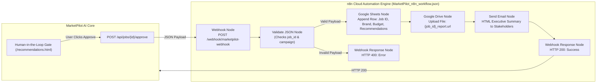

# MarketPilot AI — n8n Cloud Downstream Automation Workflow

```mermaid
graph LR
    subgraph MarketPilot["MarketPilot AI Core"]
        Gov["Human-in-the-Loop Gate (/recommendations.html)"]
        HookSender["POST /api/jobs/{id}/approve"]
    end

    subgraph n8nWorkflow["n8n Cloud Automation Engine (MarketPilot_n8n_workflow.json)"]
        WH["Webhook Node<br/>POST /webhook/marketpilot-webhook"]
        Val["Validate JSON Node<br/>(Checks job_id & campaign)"]
        Sheets["Google Sheets Node<br/>Append Row: Job ID, Brand, Budget, Recommendations"]
        Drive["Google Drive Node<br/>Upload File: {job_id}_report.url"]
        Email["Send Email Node<br/>HTML Executive Summary to Stakeholders"]
        RespOK["Webhook Response Node<br/>HTTP 200: Success"]
        RespErr["Webhook Response Node<br/>HTTP 400: Error"]
    end

    Gov -->|User Clicks Approve| HookSender
    HookSender -->|JSON Payload| WH
    WH --> Val
    Val -->|Valid Payload| Sheets
    Val -->|Invalid Payload| RespErr
    Sheets --> Drive
    Drive --> Email
    Email --> RespOK
    RespOK -->|HTTP 200| MarketPilot
```
