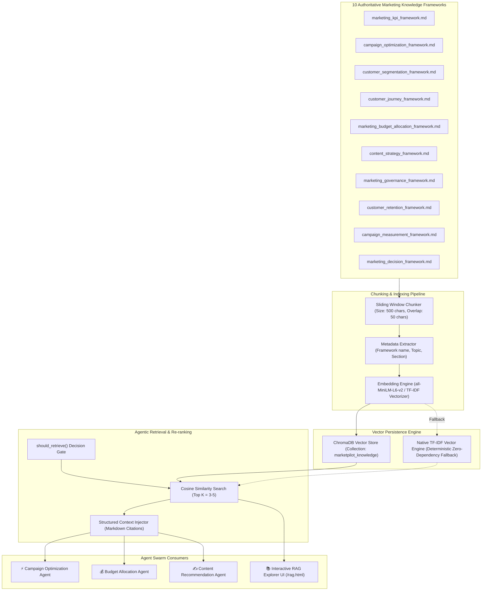

# MarketPilot AI — RAG Knowledge Base Architecture

```mermaid
graph TD
    subgraph KnowledgeBase["10 Authoritative Marketing Knowledge Frameworks"]
        D1["marketing_kpi_framework.md"]
        D2["campaign_optimization_framework.md"]
        D3["customer_segmentation_framework.md"]
        D4["customer_journey_framework.md"]
        D5["marketing_budget_allocation_framework.md"]
        D6["content_strategy_framework.md"]
        D7["marketing_governance_framework.md"]
        D8["customer_retention_framework.md"]
        D9["campaign_measurement_framework.md"]
        D10["marketing_decision_framework.md"]
    end

    subgraph IngestionPipeline["Chunking & Indexing Pipeline"]
        Chunker["Sliding Window Chunker (Size: 500 chars, Overlap: 50 chars)"]
        MetaExtract["Metadata Extractor (Framework name, Topic, Section)"]
        Embedder["Embedding Engine (all-MiniLM-L6-v2 / TF-IDF Vectorizer)"]
    end

    subgraph StorageEngine["Vector Persistence Engine"]
        ChromaStore["ChromaDB Vector Store (Collection: marketpilot_knowledge)"]
        TFIDFStore["Native TF-IDF Vector Engine (Deterministic Zero-Dependency Fallback)"]
    end

    subgraph RetrievalLayer["Agentic Retrieval & Re-ranking"]
        Trigger["should_retrieve() Decision Gate"]
        SemanticSearch["Cosine Similarity Search (Top K = 3-5)"]
        ContextFormatter["Structured Context Injector (Markdown Citations)"]
    end

    subgraph Consumers["Agent Swarm Consumers"]
        Agent_Opt["⚡ Campaign Optimization Agent"]
        Agent_Bud["💰 Budget Allocation Agent"]
        Agent_Content["✍️ Content Recommendation Agent"]
        RAG_Explorer["📚 Interactive RAG Explorer UI (/rag.html)"]
    end

    KnowledgeBase --> Chunker
    Chunker --> MetaExtract
    MetaExtract --> Embedder
    Embedder --> ChromaStore
    Embedder -.->|Fallback| TFIDFStore

    Trigger --> SemanticSearch
    ChromaStore --> SemanticSearch
    TFIDFStore -.-> SemanticSearch
    SemanticSearch --> ContextFormatter
    ContextFormatter --> Agent_Opt
    ContextFormatter --> Agent_Bud
    ContextFormatter --> Agent_Content
    SemanticSearch --> RAG_Explorer
```
